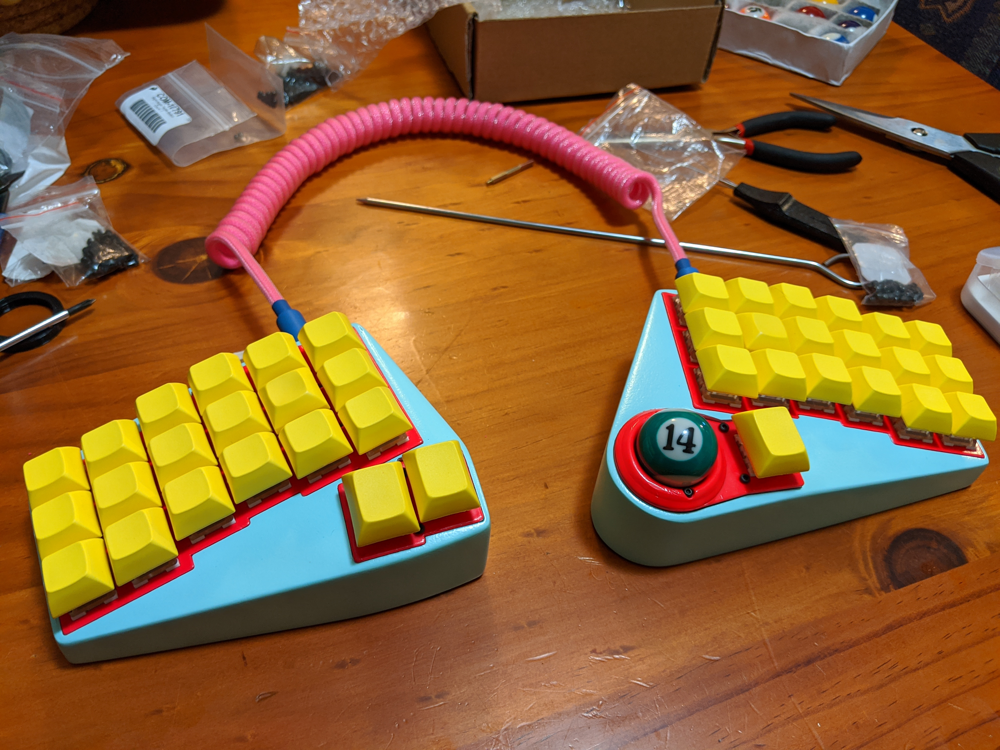

# Oddball Keyboard

The Oddball is a split mechanical keyboard with an integrated trackball. While drawing inspiration from things like the [Jian](https://github.com/KGOH/Jian-Info) and the [Dactyl Manuform](https://github.com/abstracthat/dactyl-manuform), it is instead designed with a switch plate and PCB to give it durability, replicability, and a more utilitarian look. It has a relatively minimal key layout, typically with 39 keys in total. The PCB is reversible so it can be built with 0, 1 or theoretically 2 trackballs. Due to the height and angle of the optical sensor, and as an ergonomic bonus, it requires a tented case.

## [View the docs](https://atulloh.github.io/oddball)

## Features
- split design
- 39 keys
- trackball
- click, click + drag, scroll
- dynamic CPI (trackball cursor speed)
- columnar staggered keys
- tented case
- angled thumb clusters
- QMK firmware

Feel free to [reach out](https://atulloh.github.io/oddball/about-me) if you have any questions.

# License

MIT License

Copyright (c) 2021 Alexander Tulloh